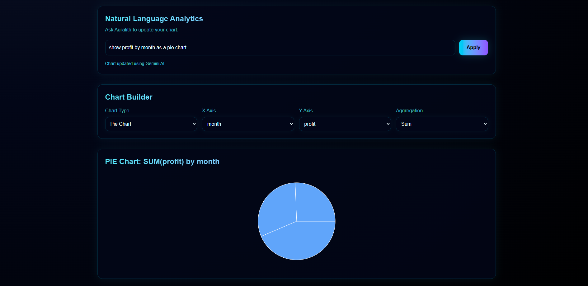

# Auralith

AI-powered dataset exploration. Upload a CSV, XLSX, or JSON file and Auralith profiles your columns, surfaces KPIs and insights, generates charts from natural-language prompts, and lets you chat with your data.



## Features

- **Drop-in uploads** for CSV, XLSX, and JSON. The original file is preserved alongside a parsed JSON projection so the workspace can reload instantly.
- **Automatic column profiling** — type inference (number vs. text), missing-value counts, uniqueness, and min/max/average for numeric columns.
- **Rule-based insights** — plain-English observations like "North has the highest total sales at 1,600" generated from the column summaries.
- **Natural-language charts** — type "average profit by region" and Auralith maps it to a validated chart config (`chartType`, `xAxis`, `yAxis`, aggregation, optional equals-filter), rejecting prompts that reference columns the dataset doesn't have.
- **Per-dataset chat** — ask follow-up questions about a dataset; the assistant sees a column summary, a 50-row sample, and the last 20 messages, and refuses gracefully when a question is off-topic.
- **Authenticated workspaces** — every dataset is scoped to the user who uploaded it.

## Stack

- **Framework:** Next.js 16 (App Router), React 19, TypeScript
- **Styling:** Tailwind v4, Framer Motion
- **Charts:** Recharts
- **Auth:** NextAuth (credentials provider) + Prisma adapter, bcrypt password hashing
- **Database:** PostgreSQL via Prisma 6
- **Blob storage:** AWS S3 (`@aws-sdk/client-s3`)
- **AI:** Google Gemini (`gemini-2.5-flash`) via `@google/generative-ai`
- **Parsing:** PapaParse for CSV, SheetJS (`xlsx`) for Excel

## Architecture

```
Browser  ──┬──►  Next.js App Router  ──►  Postgres (Prisma)
           │            │
           │            ├──►  S3  (original file + parsed projection)
           │            │
           │            └──►  Gemini  (chat + chart-config generation)
           │
           └─── Client-side parsing (PapaParse / xlsx) before upload
```

Two AI surfaces, two different patterns:

- `POST /api/ai/ask` — conversational. Stores the user turn, replays the last 20 messages, sends column summaries plus the first 50 rows to Gemini, and uses a sentinel (`UNSUPPORTED:`) for off-topic questions.
- `POST /api/ai/chart` — structured. Asks Gemini to return JSON only, validates it against a strict schema, retries once with the failure reason if validation fails, and rejects any column name that isn't in the dataset before returning.

## Getting started

Prerequisites: Node 20+, a Postgres database, an S3 bucket, and a Gemini API key.

```bash
git clone <this-repo>
cd auralith
npm install
cp .env.example .env   # then fill in the values below
npx prisma migrate dev
npm run dev
```

Open http://localhost:3000.

### Environment variables

See `.env.example` for the full list. At minimum you'll need:

```
DATABASE_URL=postgresql://...
NEXTAUTH_SECRET=...
NEXTAUTH_URL=http://localhost:3000
AWS_REGION=us-east-2
AWS_S3_BUCKET=...
GEMINI_API_KEY=...
```

`AWS_ACCESS_KEY_ID` and `AWS_SECRET_ACCESS_KEY` can be set explicitly or picked up from your AWS CLI / instance role.

## Project layout

```
app/
  api/
    ai/ask/            Chat endpoint (per-dataset, persisted history)
    ai/chart/          Natural-language → validated chart config
    auth/              NextAuth handlers + registration
    datasets/          List, fetch, upload
  datasets/[id]/       Dataset detail workspace
  login/ register/     Auth screens
  page.tsx             Upload + dataset history landing page
components/            Workspace UI (chart, KPIs, insights, chat, etc.)
lib/
  detectColumns.ts     Column type inference + numeric stats
  generateInsights.ts  Rule-based plain-English insights
  api.ts               Typed fetch wrappers for every endpoint
  auth.ts s3.ts prisma.ts
prisma/                Schema + migrations
types/dataset.ts       Shared Row / ColumnSummary / DatasetRecord types
```

## Roadmap

- Read-only share links for datasets
- Test suite around `detectColumns` and the chart-config validator
- Server-side parsing for files too large for the browser
- Export charts as PNG/SVG
- Multiple sheets per XLSX upload

## License

Private project. All rights reserved.
